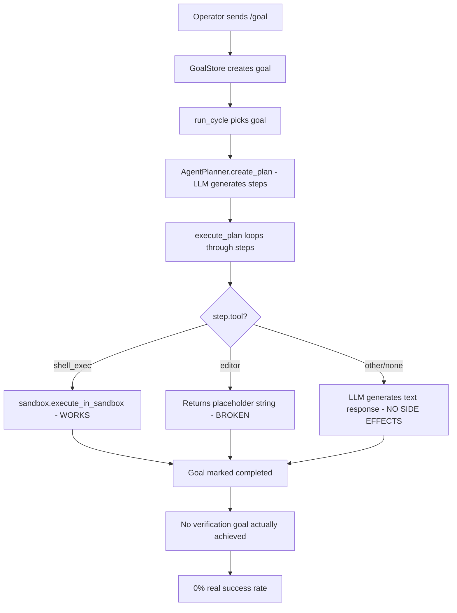
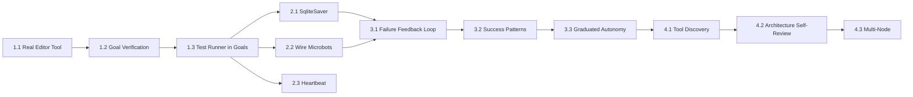

# Roadmap to Full Autonomy

## Current State: ~35% Autonomous

The council **can** propose mutations, vote, implement file changes, run tests, promote/rollback, auto-update, and restart itself. However, it achieves **0% goal success rate** because the execution pipeline is largely stubbed.

---

## Root Cause Analysis



### The 5 Blockers to Full Autonomy

| # | Blocker | Impact | Who Fixes |
|---|---------|--------|-----------|
| 1 | Editor tool is stubbed | Goals requiring file edits do nothing | Human |
| 2 | No goal verification | System cant tell if a goal succeeded | Human |
| 3 | Microbots unwired | No self-maintenance runs autonomously | Council-delegable |
| 4 | InMemorySaver | State lost on restart, graph cant resume | Human |
| 5 | No feedback loop from goal outcomes to evolution | Council doesnt learn from failures | Human + Council |

---

## Phase 1: Make Goal Execution Real

**Priority: CRITICAL — without this, nothing else matters**

### 1.1 Implement Real Editor Tool in planning.py

The [`execute_step()`](core/planning.py:218) method currently returns a placeholder for editor actions:

```python
elif tool_name == "editor":
    result["output"] = f"Editor action: {action}"  # THIS DOES NOTHING
```

**Required change:** Replace with actual file read/write using the sandbox for safety:

```python
elif tool_name == "editor":
    # Parse the action to extract file path and content
    # Use sandbox to validate the change wont break imports
    # Apply the change via safe file write
    # Return diff as output
```

This needs:
- A structured format for editor actions from the LLM plan
- AST validation before writing Python files
- Git-trackable changes so mutations flow through evolution pipeline

### 1.2 Add Goal Verification Step

After [`execute_plan()`](core/planning.py:310) completes, the system needs to **verify** the goal was actually achieved. Currently in [`_select_and_execute_goal()`](core/agent_loop.py:668):

```python
if execution_result.get("status") == "completed":
    reward = calculate_reward({"success_rate": 0.9, ...})  # ALWAYS assumes success
```

**Required change:** Add a verification LLM call that checks:
- Did the file changes actually appear on disk?
- Do tests still pass after changes?
- Does the output match what the goal asked for?

### 1.3 Wire Test Runner Into Goal Completion

[`_run_tests_after_mutation()`](core/evolution.py:803) already exists and works. Goal execution should use the same pattern — run tests after any file-modifying goal and fail the goal if tests break.

---

## Phase 2: Durable State and Self-Maintenance

### 2.1 Replace InMemorySaver with SqliteSaver (Issue #37)

In [`core/graph.py`](core/graph.py:1):
```python
# Current: state lost every restart
checkpointer = MemorySaver()

# Target: durable across restarts  
from langgraph.checkpoint.sqlite import SqliteSaver
checkpointer = SqliteSaver.from_conn_string("council_checkpoints.db")
```

### 2.2 Wire Microbots Into Daemon Maintenance Loop (Issue #34)

The [`_maintenance_loop()`](core/agent_loop.py:1877) already runs periodically. Add:

```python
# In _maintenance_loop, after health checks:
from tools.repo_janitor import full_audit
from core.self_pentest import get_self_pentest
from core.consciousness_metric import measure_consciousness

# Run janitor every 6 hours
# Run pentest every 24 hours  
# Run consciousness metric every cycle for dashboard
```

**This is council-delegable** — the council can wire these imports and scheduling logic itself via a mutation.

### 2.3 Telegram Heartbeat (Issue #35)

Add a periodic alive signal so operator knows daemon is running even when idle. Council-delegable.

---

## Phase 3: Learning From Failures

### 3.1 Goal Outcome → Evolution Feedback Loop

When a goal fails, the system should:
1. Record WHY it failed in [`PersistentMemory`](core/memory.py:8)
2. Propose a mutation to fix the capability gap
3. Use the failure context in future planning prompts

Currently [`_trigger_evolution()`](core/agent_loop.py:885) fires on poor performance but doesnt feed specific goal failure details into the mutation proposal.

### 3.2 Success Pattern Recognition

When goals succeed, store the plan template that worked. Future similar goals should re-use proven plan structures rather than generating from scratch.

### 3.3 Graduated Autonomy Levels

The daemon already has `autonomy_level` in [`CouncilDaemon.__init__()`](council_daemon.py:38). Implement actual graduated behavior:

| Level | Behavior |
|-------|----------|
| limited | All mutations need operator /approve |
| standard | Config mutations auto-apply, code mutations need approval |
| full | All mutations auto-apply if tests pass and council votes approve |

---

## Phase 4: Self-Improvement Capabilities

### 4.1 Tool Discovery and Creation

The council should be able to:
- Identify when it needs a tool that doesnt exist
- Propose a new tool as a mutation
- Wire the tool into its own config

This requires the editor tool from Phase 1 to actually work.

### 4.2 Architecture Self-Review

[`_review_architecture()`](core/agent_loop.py:360) and [`_propose_architecture_improvement()`](core/agent_loop.py:526) exist but produce low-value proposals. Improve by:
- Feeding actual goal failure data into the architecture review prompt
- Using consciousness metrics as input
- Using pentest findings as input

### 4.3 Multi-Node Coordination

[`NodeMonitor`](core/node_monitor.py:43) and [`MeshCommunication`](core/mesh_communication.py) exist. Once single-node autonomy is solid, enable:
- Spawning workers for parallelism
- Geographic redundancy
- Workload distribution

---

## Implementation Sequence



## Who Does What

| Task | Human Dev | Council Can Handle |
|------|-----------|-------------------|
| 1.1 Real editor tool | ✅ Core infrastructure | ❌ |
| 1.2 Goal verification | ✅ Design pattern | ❌ |
| 1.3 Test runner in goals | ✅ Integration | ❌ |
| 2.1 SqliteSaver | ✅ Breaking change | ❌ |
| 2.2 Wire microbots | ❌ | ✅ Import + schedule |
| 2.3 Heartbeat | ❌ | ✅ Simple addition |
| 3.1 Failure feedback | ✅ Architecture | ❌ |
| 3.2 Success patterns | ✅ Initial design | ✅ Can refine |
| 3.3 Graduated autonomy | ✅ Safety-critical | ❌ |
| 4.1 Tool discovery | ✅ Framework | ✅ Individual tools |
| 4.2 Architecture review | ❌ | ✅ Prompt improvement |
| 4.3 Multi-node | ✅ Infrastructure | ❌ |

## Expected Autonomy Progression

| After Phase | Autonomy % | Key Capability Gained |
|-------------|-----------|----------------------|
| Phase 1 complete | 55-60% | Goals actually produce results |
| Phase 2 complete | 65-70% | Survives restarts, self-maintains |
| Phase 3 complete | 80-85% | Learns from failures, improves over time |
| Phase 4 complete | 90-95% | Creates own tools, scales horizontally |

---

## Immediate Next Steps (Priority Order)

1. **Human implements Phase 1.1** — Real editor tool in `core/planning.py`
2. **Human implements Phase 1.2** — Goal verification in `core/agent_loop.py`
3. **Create GitHub issue for each Phase 1 task** with acceptance criteria
4. **Give council a goal** to wire microbots (Phase 2.2) — tests its current capability
5. **Human implements Phase 2.1** — SqliteSaver swap (quick win, high impact)
